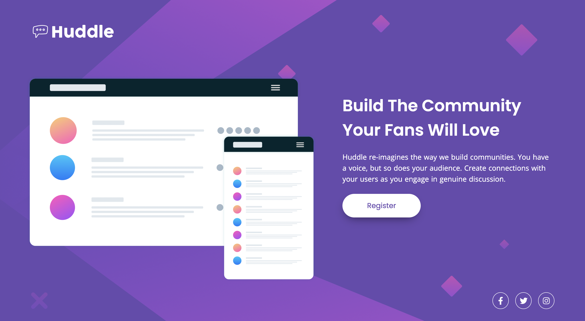

</img>

<h1 align="center">Huddle landing page with a single introductory section</h1>

  <h3>
    <a href="" color="white">
      Projeto
    </a>
     |     <a href="https://www.frontendmentor.io/challenges/huddle-landing-page-with-a-single-introductory-section-B_2Wvxgi0">
      Desafio
    </a>
  </h3>

   Solução de um desafio de <a href="https://www.frontendmentor.io/" target="_blank">frontendmentor.io</a>.

 
 
 

👨‍💻 Sobre o projeto;

É desafio perfeito para iniciantes, o projeto fará com que você trabalhe com um layout de duas colunas.
O principal desafio é construir essa página e deixar o mais próximo possível do design que eles dão a você.
E também, pode usar qualquer ferramenta para concluir o desafio. Portanto, se tem algo que você gosta ou gostaria de praticar, sinta-se à vontade para tentar.
  O que o usuário/cliente deve conseguir usar e fazer;
 1. Visualizar o layout ideal dependendo do tamanho da tela do dispositivo. (Responsivo)
 2. Veja o hover/interação ao usar os elementos, Registrar e de Redes Sociais.
 
  
 Infelizmente, não tenho acesso ao projeto no Figma, então o design não é o perfeito;

🚀 Tecnologias;

- HTML5
- CSS3
- Flexbox

📃 O que eu aprendi?

Foi um projeto bom para praticar flex e tornar o projeto responsivo, usei uma propiedade inline-flex, que sabia da existência porém não tinha colocado em prática, e entendi como ela realmente funciona.
